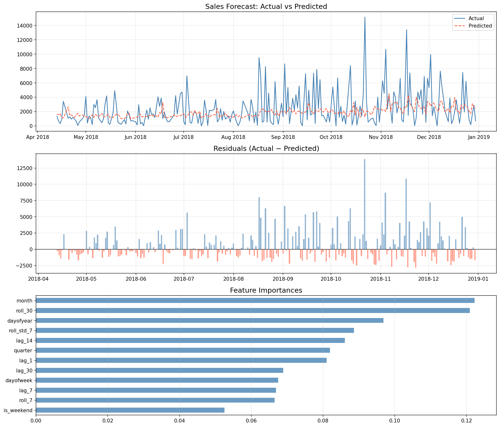

# 📈 Sales & Demand Forecasting for Businesses
### Future Interns — Machine Learning Internship | Task 1

---

## 📌 Project Overview
This project builds a Machine Learning model to forecast future sales demand
using historical business data from the Superstore Sales Dataset.
The goal is to help businesses predict daily sales and make data-driven decisions.

---

## 🗂️ Dataset
- **Source:** Superstore Sales Dataset — Kaggle
- **Period:** January 2015 – December 2018
- **Records:** 9,800+ transactions aggregated to 1,230 daily sales entries
- **Target Variable:** Daily Sales Revenue (USD)

---

## ⚙️ Methodology

### 1. Data Preprocessing
- Parsed and cleaned date columns
- Aggregated transaction-level data to daily sales
- Handled missing values and outliers

### 2. Feature Engineering
| Feature | Description |
|---------|-------------|
| lag_1, lag_7, lag_14, lag_30 | Previous day/week/month sales |
| roll_7, roll_30 | 7-day and 30-day rolling averages |
| roll_std_7 | 7-day rolling standard deviation |
| month, quarter | Seasonal time features |
| dayofweek, dayofyear | Cyclical time features |
| is_weekend | Weekend indicator |

### 3. Model
- **Algorithm:** XGBoost Regressor
- **Train/Test Split:** 80% / 20% (time-aware, no data leakage)
- **Validation:** Time Series Split

---

## 📊 Results

| Metric | Value |
|--------|-------|
| MAE (Mean Absolute Error) | $1,683.02 |
| RMSE (Root Mean Squared Error) | $2,454.45 |
| Forecast Period | Apr 2018 – Dec 2018 |
| Avg Actual Daily Sales | $2,420.40 |
| Avg Predicted Daily Sales | $1,921.09 |

### 🔍 Top Predictive Features
1. **Month** — importance score: 0.1222
2. **30-day Rolling Average** — importance score: 0.1209
3. **Day of Year** — importance score: 0.0969

---

## 📉 Forecast Chart

---

## 🛠️ Tools & Technologies
| Tool | Purpose |
|------|---------|
| Python 3.14 | Core programming language |
| Jupyter Notebook | Development environment |
| Pandas | Data manipulation |
| NumPy | Numerical computing |
| XGBoost | Forecasting model |
| Matplotlib | Data visualization |
| Scikit-learn | Model evaluation metrics |
| GitHub | Version control & submission |

---

## 📁 Repository Structure

---

## ✅ Internship Details
- **Organization:** Future Interns
- **Domain:** Machine Learning
- **Task:** 1 of 3
- **Track Code:** ML
- **Repository:** FUTURE_ML_01

---

*Submitted as part of the Future Interns Machine Learning Internship Program*
